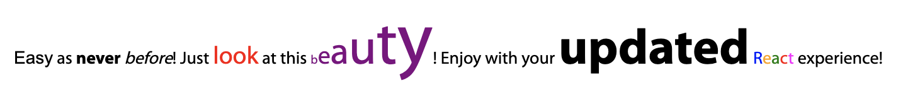

## Alphabet v0.1

In the evolution of web development, HTML, initially designed primarily for text markup, has found limitations in meeting the demands of modern frontend development (actually, you even can't use this old-style stuff anymore!)

Recognizing this gap, the Alphabet v0.1 package emerges as the next-level solution in the React ecosystem. Say goodbye to conventional text output with old regular letters and digits – welcome the era where each letter gets its own dedicated component! Hooray for a more expressive and dynamic development experience!

Control as much as you can!

Of course some typographic symbols starter pack is also included! Check the `examples`! 

[Buy me a coffee] or something for my `head` :lol:

P.S. It was way too hard to wait till April 1st. Don't get it very serious. It's just a kinda `sarcasm`.

[//]: # 

[Buy me a coffee]: https://www.buymeacoffee.com/groont

